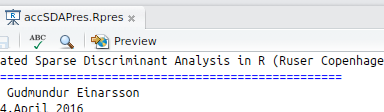
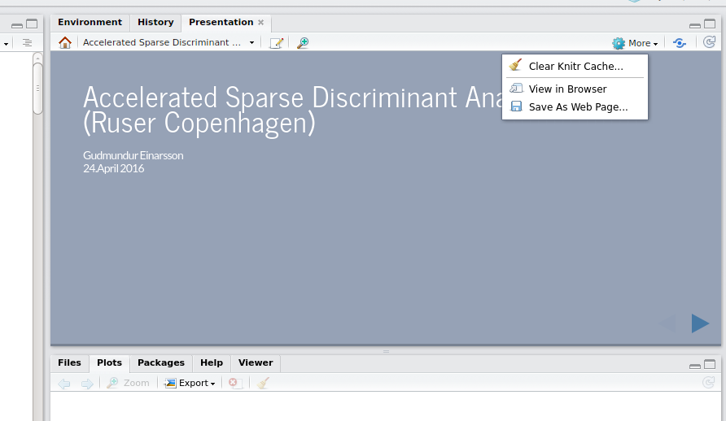

# Presentation in useR CopenhagenR meetup
## 26th of Arpil 2016

This presentation is made in Rstudio. The presentation file `accSDAPres.Rpres` contains the markdown for the presentation. Just open the file in Rstudio and click on the `preview` button:

Now you can browse the presentation in Rstudio, or preferably open it in a browser, (*which is much nicer*). To open it in a browser, click the `More` button in the presentation pane and select `View in Browser`.

Hope you enjoyed the talk! Look forward to see you guys again!
