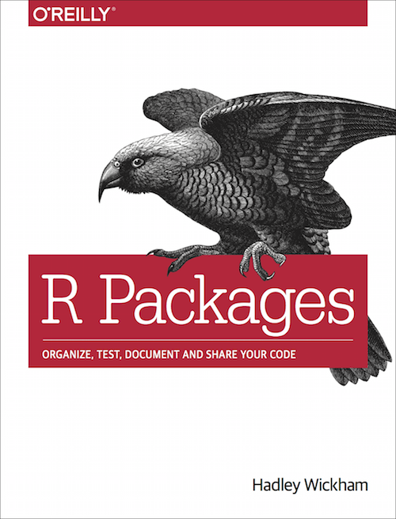
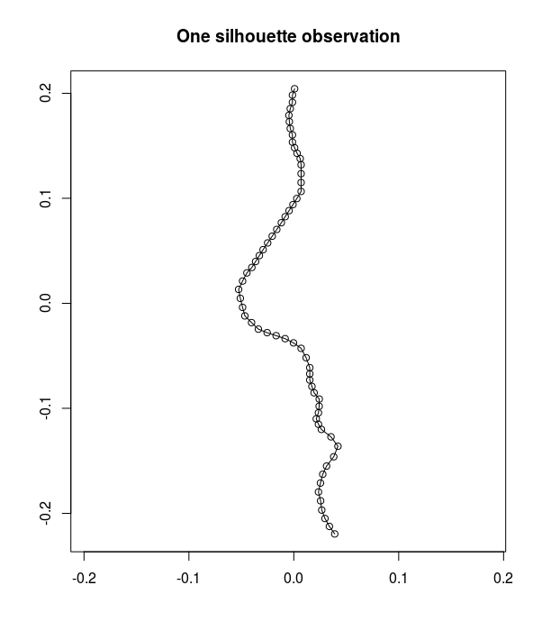
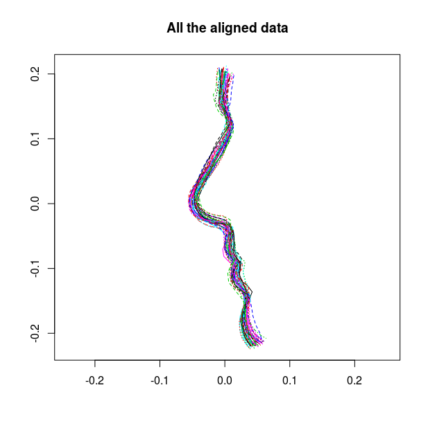
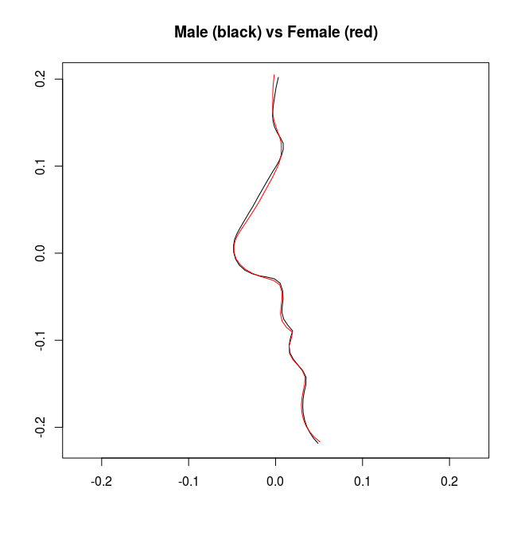
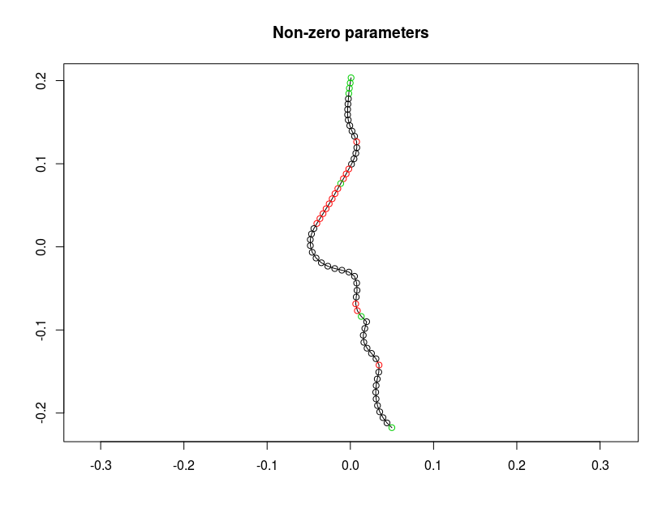
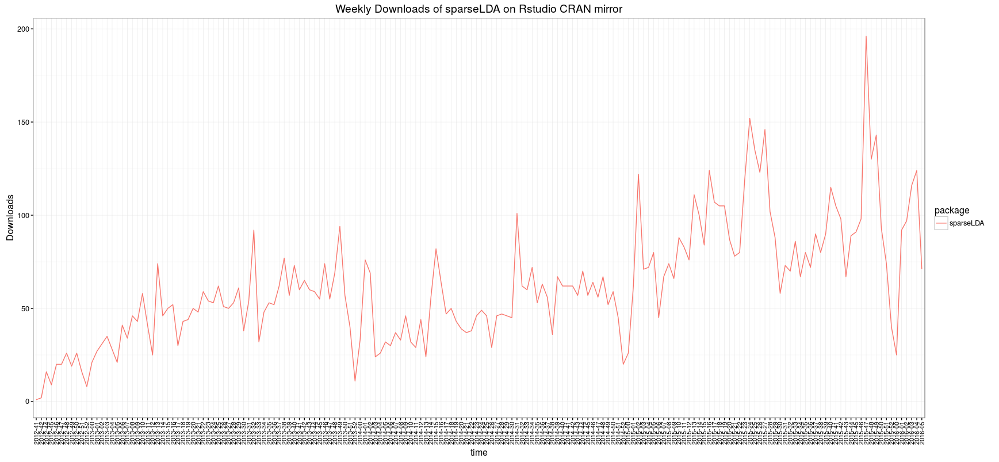
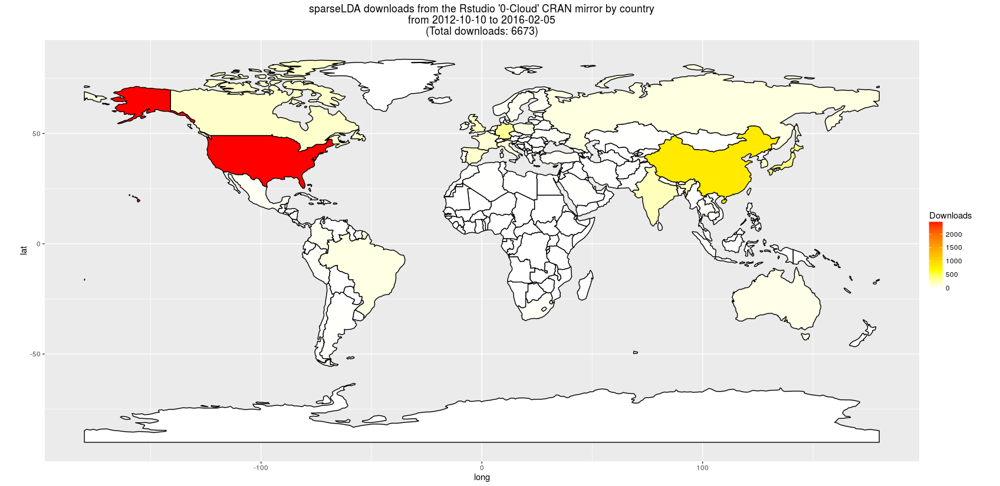
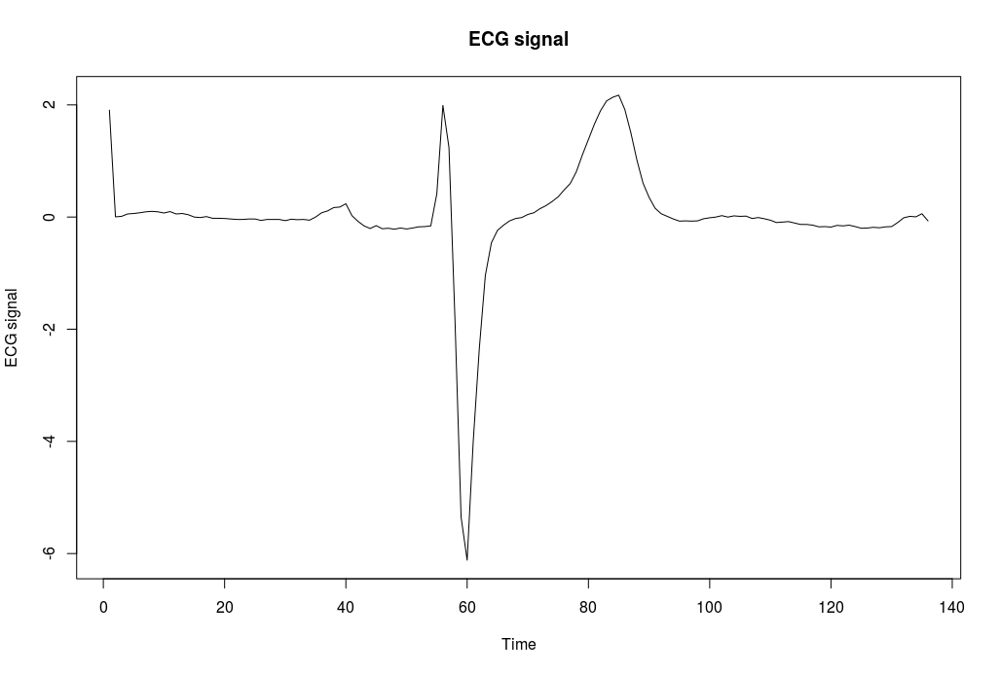
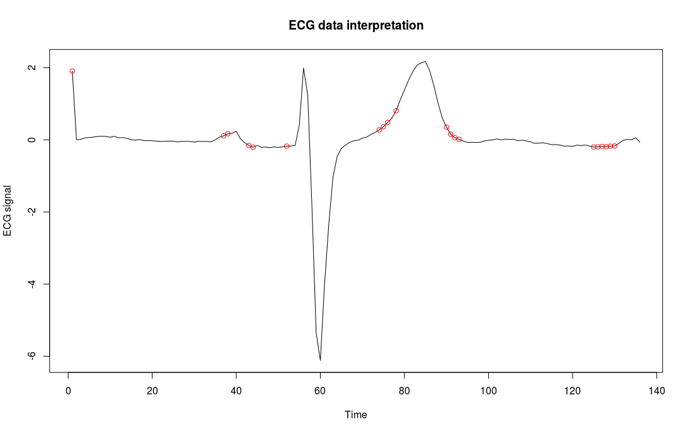

Accelerated Sparse Discriminant Analysis in R (Ruser Copenhagen)
========================================================
author: Gudmundur Einarsson
date: 24.April 2016
autosize: true
transition: rotate

First, thanks!
========================================================

- Nice venue to meet people and hear from others
- Really cool that the organizer put in the effort to plan this
- Hope I can come again to talk about other R related stuff later
- This is mostly a teaser for the accSDA package
- If things are unclear do not hesitate to send me a mail with questions
  - guei@dtu.dk

Overview
========================================================

- *Who* are we?
- *Why* write packages?
- *What* is the problem?
- *What* is in the accSDA package?
- *Where/When* can I get it?

Who is doing this
========================================================

- **Line Clemmensen**
  - Associate Professor at DTU Compute Section for Statistic and Data Analysis.
- **Brendan Ames**
  - Assistant Professor at the Department of Mathematics at the University of Alabama.
- **Gudmundur Einarsson**
  - PhD student at DTU Compute Section for Image Analysis and Computer Graphics.
- **Summer Atkins**
  - Student  at the Department of Mathematics at the University of Alabama.

Why write a package?
========================================================

- Saw an interview with Romain Francois from useR 2014.
- If you could go back in time, what would you tell yourself?
- Write more packages!

What is there to gain?
========================================================

- Force yourself to structure/refactor your code!
- Force yourself to comment your code!
- Easier to share an encapsulated package.
- You can include data in a package!
- Easier to pick up on the work later.
- This is not emphasized enough in uni stat courses!

Good free resource to start!
========================================================

<center>

</center>

So what am I really going to talk about?
========================================================

- Supervised classification
- Regularization
- accSDA package to perform this!
- I'll try to focus mostly on the R part!

Recap from last meetup!
========================================================

You all remember the lasso:
$$
\displaystyle{\min_{\boldsymbol{\beta}}}
\|\mathbf{y} -\mathbf{X} \boldsymbol{\beta}\|^2  +
\lambda \|\boldsymbol{\beta}\|_1
$$

In **classification** the response is an indicator matrix ($\mathbf{Y}$) for class belongings.
<br>
<br>
$$
\mathbf{Y} = \begin{bmatrix}
1 & 0 & 0\\
1 & 0 & 0\\
0 & 1 & 0\\
\vdots & \vdots & \vdots\\
0 & 0 & 1
\end{bmatrix}
$$


Similar but different!
========================================================

Sparse optimal scoring:
<br>
<br>
$$
\begin{array}{rl}
		\displaystyle{\min_{\boldsymbol{\beta_k}, \boldsymbol{\theta_k}}} & \|\mathbf{Y} \boldsymbol{\theta_k} -\mathbf{X} \boldsymbol{\beta_k}\|^2 + \lambda \|\boldsymbol{\beta_k}\|_1 \\
		\text{s.t.} & \frac{1}{n} \boldsymbol{\theta_k^T} \mathbf{Y}^T\mathbf{Y} \boldsymbol{\theta_k} = 1, \;\; \boldsymbol{\theta_k^T} \mathbf{Y}^T \mathbf{Y} \boldsymbol{\theta}_\ell = 0 \; \forall \ell < k,
	\end{array}
$$

- This is just one of many ways to do supervised classification.
- Let's focus on the usage and how we do this in R!

Little motivating example
========================================================

- Let's extract the silhouettes of portrait images.
  - 39 observations
  - 130 variables
  - Labels for females and males
  - Align them with Procrustes analysis

One observation
========================================================

<center>

</center>

All the data
========================================================

<center>

</center>

What do I want and what are the issues?
========================================================

- I want a classifier!
  - Is a new observation male or female???
- Understand which part of the silhouette is most important to distinguish between sexes!
  - Interpretation and model selection.
- The dataset has more features than observations ($p>n$), what to do?
  - Here we use regularization.

Naive first approach
========================================================

Let's just plot the mean male and female shapes!
<center>

</center>

Let's try this using the accSDA package!
========================================================

- Coordinates are in a data matrix $\mathbf{X}$ (*Xtrain*)
  - Can be a data.frame or a matrix.
- Labels $\mathbf{Y}$ (*Ytrain*)
  - Can be an indicator matrix or a factor.

An then the simplest way to do it is:


```r
# Run with default configuration
resDef <- ASDA(Xtrain,Ytrain)
```

Let's do CV
========================================================


```r
# Cross-validation parameters
lam <- seq(0.0001,0.002,len=30)
method <- "SDAAP"
control <- list(CV = TRUE, folds = 10, feat = 0.5, quiet = FALSE)

# Run the algorithm
res <- ASDA(Xt = Xtrain, Yt = Ytrain, lam = lam, method = method, control = control)
```

Now I get some interpretation!
========================================================

<center>

</center>

But why make a new package?
========================================================

- There is growing interest in doing sparse discriminant analysis.
- First proposed solution is from 2011 (sparseLDA on CRAN).
- There is steady growth in the number of downloads.
- There are several issues that need to be fixed.
  - **Speed:** This is the main motivation for the new package
  - **More functionality:** Default tools that come with the package for plotting and analysing results.
  - **Intuitive usage:** Good default parameters such that most end-users can get started fast.
- Solving these issues will expose this to a larger audience.

Weekly downloads (late 2012 to early 2016)
========================================================
<br>


Why so few donwloads in Scandinavia???
========================================================
<br>


Another motivating example (ECG data)
========================================================

Electro Cardiograms from UCR time series classification/clustering homepage

|Data set | p| k | n|Train Size | Test Size| CV-folds | #feats|
|:------------|-----------:|:------------:|-----------:|:-------|:-------|:-------|:-------|
|Electrocardiogram measurements (ECG)          |         136|     2      |         884|23  |861|5|0.15|

- Labels are healthy or not
- Only 38 misclassified of 861, (test error less than 5%)
- Takes 7 seconds to train

Example of data
========================================================
<br>


Interpretations we get!
========================================================
<br>


Where can I get the package?
========================================================

- Will be on github soon, most likely tomorrow!
  - My username is **gumeo**.
- There will be a README.md file with installation instructions.
- I'll also put this presentation there!

How did I do this?
========================================================

Documentation is done with roxygen2 and the devtools package was used for creating and building the package.

This allows for a very streamlined workflow for implementation and testing.

Make good plans before release!
========================================================

The core ideas behind the implementation are:
- **Simplicity**
  - Good default parameters to allow users to try it fast.
  - Typechecking to accommodate most intuitive inputs, e.g. factors for labels.
  - Basic errors catched and meaningful error messages supplied.
- **Speed**
  - New implementations of optimization algorithms.
- **Tools for analysis**
  - Default *plot/barplot/print/summary/predict* functions for objects.

Thanks!
========================================================

- I have plenty of ideas on stuff to add!
- If you have ideas, you are welcome to email me regarding collaboration or feedback on the package!
- Again my e-mail is guei@dtu.dk in case you have questions/input!

Thank you again for coming!
========================================================

<center>

</center>
